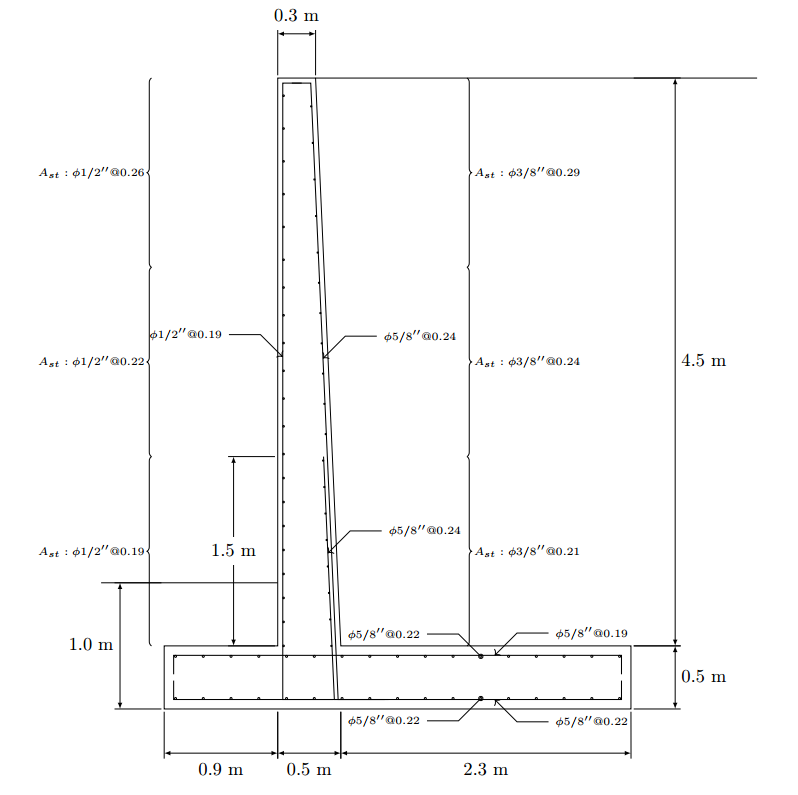

# RetWall.jl
`RetWall.jl` es un paquete para diseño de muros de contención, por ahora, solo está
destinado al diseño de muros típicos usando la teoría de presión de tierra de Rankine,
sin embargo, se espera que a futuro estás condiciones mejoren. Una de las funcionalidades
más importantes es que nos generará una memoria de cálculo automática, para esto es
necesario tener instalado LaTeX.

La memoria o reporte de cálculo incluirá un dibujo, de ser el caso, de la distribución de
refuerzo propuesta para el muro.
<div align="center"> </img></div>

## Prerequisitos
- Tener instalado LaTeX
- Tener conexión activa a internet

## Instalación
- Descargar el paquete de la página de GitHub https://github.com/4lrdyD/RetWall
-  Abrimos Julia
- Tecleamos ] para entrar al entorno de manejo de paquetes.
- Creamos el proyecto tipeando:

  `(@v1.9) pkg> generate ./.julia/packages/RetWall`
- Con el paso anterior habremos creado la carpeta para alojar el paquete, esta contendrá una subcarpeta llamada `src`, debemos copiar en esta, todo el contenido de
la carpeta `src` contenida en el zip descargado, por defecto la carpeta creada estará
alojada en:

  * <div>En Windows: C:\Users\&lt;usuario&gt;\.julia\packages\RetWall</div>
  * <div>En Ubuntu: /home/&lt;usuario&gt;/.julia/packages/RetWall</div>

  Cuando nos pregunte si queremos reemplazar el archivo RetWall.jl le daremos en
  aceptar.
- Volvemos a Julia y tipeamos:
```
(@v1.9) pkg> dev ./.julia/packages/RetWall
(@v1.9) pkg> activate ./.julia/packages/RetWall
(RetWall) pkg> add LinearAlgebra
(RetWall) pkg> activate @v1.9
(@v1.9) pkg> add LinearAlgebra
```


- Presionamos la tecla retroceso (backspace), para volver a la REPL de Julia
- tipeamos:
  
`using RetWall`

## Modo de uso
Las siguientes líneas muestran el diseño estándar completo de un muro de contención
típico en voladizo.
```
mywall=typeIwall(b1=.9,t2=.0,t1=.3,t3=.2,b2=2.3,hz=.5,hp=4.5);
orient_model!(mywall.model);
mywall.D=1;
mywall.q=10;
addsoil!(mywall.model,[25 0 16.5]);
addsoil!(mywall.model,[25 13 16.5]);
addmat!(mywall.model,[21000. 0 24]);
RetWall.build_rankine_pline(mywall);
push!(mywall.model.nod,mywall.model.pnod[2:2,:]);
addmat!(mywall.model,[0 0 16.5]);
addmat!(mywall.model,[0. 0 0 420000]);#para el acero de refuerzo
push!(mywall.model.elm,[3 11 10 8 2]);
mywall.model.plinels[1,3]=2;
mywall.model.soilprop[2,5]=166;
report(mywall,design=1,ignore_pasive_moments=1);
```
## Documentación
Refiérase al 
<a href="docs/RetWall.pdf">Manual</a> en este repositorio, para más detalles de la instalación y uso.

## Contacto y otros

Para cualquier duda, comentario, reporte de problemas o sugerencias puede visitarnos
a la página de Facebook de <a href="https://www.facebook.com/profile.php?id=100063825646481">LiviCing</a> o al grupo también de <a href="https://www.facebook.com/groups/735821506541601">LiviCing</a>. También se puede
reportar cualquier error en este <a href="https://github.com/4lrdyD/RetWall">repositorio</a>.


